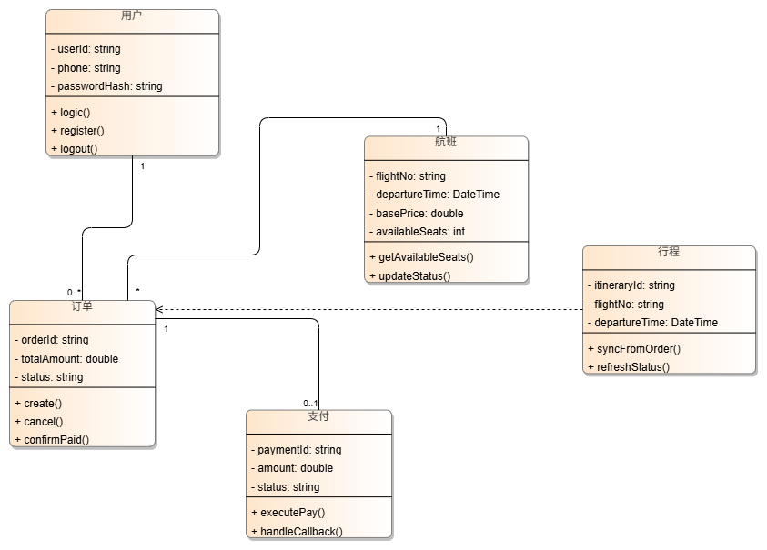
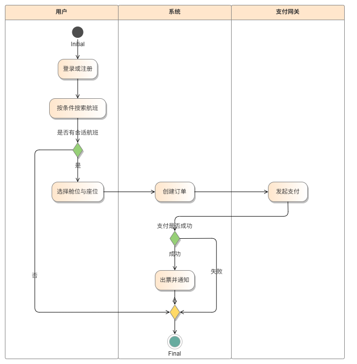
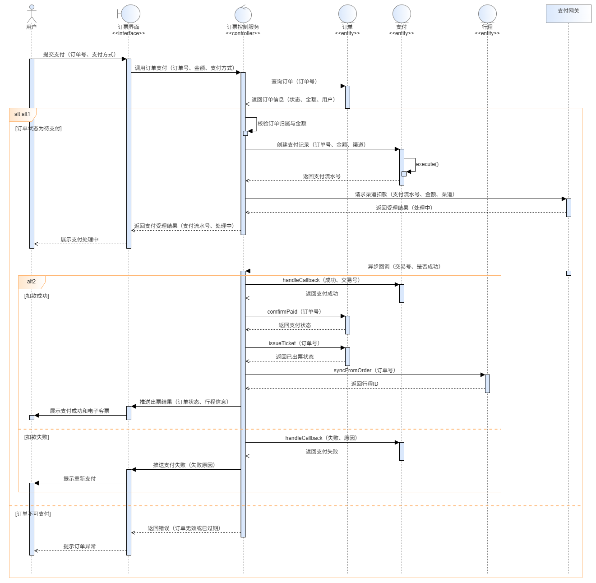

# 机票预约平台 — 详细设计阶段报告

**项目名称**：机票预约平台  
**子系统**：机票预订与支付子系统（含行程相关能力）  
**阶段**：2.2 详细设计  
**作者**：牛雨昊 24301068  
**说明**：本文档依据前期需求分析（IR / US）及用例模型，给出核心领域类图、订票主流程活动图（竖向泳道）、支付并出票顺序图的设计说明。模型图见同目录下图件。

---

## 1. 设计范围概述

本子系统主要覆盖：

- 会员注册、登录与账号管理（与用户类相关）
- 按条件查询航班、选择舱位座位、创建订单
- 经支付网关完成支付、订单状态更新与出票通知
- 行程同步与动态刷新（与行程类相关）

### 1.1 与总体用例的对应关系

| 用例 | 本详细设计中的体现 |
|------|-------------------|
| 导入/同步行程 | 类图「行程」及 `syncFromOrder()`；顺序图成功分支调用行程实体 |
| 查看航班实时动态 | 类图「航班」及 `updateStatus()`、`getAvailableSeats()` |
| 完成支付并出票 | 活动图支付/出票分支；顺序图「支付并出票」完整交互 |
| 值机选座、订阅提醒等 | 可在后续迭代扩展，本报告以订票支付主路径为主 |

---

## 2. 类图设计

### 2.1 设计意图

类图描述订票子系统核心领域实体及其属性、操作及类间关联与依赖。顺序图中的控制类（订票控制服务）在运行时调用本图所示实体类方法，本类图不重复展开控制类与接口类。

### 2.2 类图示意

### 2.3 核心类说明

#### 2.3.1 用户

| 名称 | 类型 | 可见性 | 含义 |
|------|------|--------|------|
| userId | string | private | 用户唯一标识 |
| phone | string | private | 手机号 |
| passwordHash | string | private | 密码摘要 |

| 名称 | 可见性 | 含义 |
|------|--------|------|
| register() | public | 注册账号 |
| login() | public | 登录 |
| logout() | public | 退出登录 |

#### 2.3.2 航班

| 名称 | 类型 | 可见性 | 含义 |
|------|------|--------|------|
| flightNo | string | private | 航班号 |
| departureTime | DateTime | private | 计划起飞时间 |
| basePrice | double | private | 基准票价 |
| availableSeats | int | private | 剩余可售座位数 |

| 名称 | 可见性 | 含义 |
|------|--------|------|
| getAvailableSeats() | public | 查询剩余座位 |
| updateStatus() | public | 更新航班状态 |

#### 2.3.3 订单

| 名称 | 类型 | 可见性 | 含义 |
|------|------|--------|------|
| orderId | string | private | 订单号 |
| totalAmount | double | private | 订单总金额 |
| status | string | private | 订单状态（待支付/已支付/已出票/已取消等） |

| 名称 | 可见性 | 含义 |
|------|--------|------|
| create() | public | 创建订单 |
| cancel() | public | 取消订单 |
| confirmPaid() | public | 支付成功后更新为已支付 |
| issueTicket() | public | 出票，更新为已出票（顺序图成功分支调用） |

#### 2.3.4 支付

| 名称 | 类型 | 可见性 | 含义 |
|------|------|--------|------|
| paymentId | string | private | 支付流水号 |
| amount | double | private | 支付金额 |
| status | string | private | 支付状态 |

| 名称 | 可见性 | 含义 |
|------|--------|------|
| executePay() | public | 发起支付，创建流水并提交网关 |
| handleCallback() | public | 处理支付渠道异步回调 |

#### 2.3.5 行程

| 名称 | 类型 | 可见性 | 含义 |
|------|------|--------|------|
| itineraryId | string | private | 行程 ID |
| flightNo | string | private | 航班号 |
| departureTime | DateTime | private | 出发时间 |

| 名称 | 可见性 | 含义 |
|------|--------|------|
| syncFromOrder() | public | 从订单/出票结果同步行程 |
| refreshStatus() | public | 刷新航班动态 |

### 2.4 类之间的关系

| 关系类型 | 参与类 | 多重性 | 说明 |
|----------|--------|--------|------|
| 关联 | 用户 — 订单 | 1 : 0..* | 一名用户可有多笔订单 |
| 关联 | 订单 — 航班 | * : 1 | 多笔订单对应同一航班实例（简化） |
| 关联 | 订单 — 支付 | 1 : 0..1 | 一笔订单至多一条主支付记录 |
| 依赖 | 行程 → 订单 | — | 行程依据订单/出票结果生成或更新 |

### 2.5 设计说明

属性以 private（-）封装，对外方法以 public（+）暴露。顺序图中订票控制服务调用本类图的订单、支付、行程实体方法；接口类（订票界面）与控制类（订票控制服务）仅在顺序图中体现，不在本类图重复展开。

---

## 3. 活动图设计（竖向泳道）

### 3.1 设计意图

描述订票主流程；竖向泳道划分用户、系统、支付网关；分支经 Merge 汇合至唯一 Final。

### 3.2 活动图示意

### 3.3 泳道职责

| 泳道 | 职责 |
|------|------|
| 用户 | 登录注册、搜索航班、选座；触发「是否有合适航班」判断 |
| 系统 | 创建订单、判断支付结果、出票并通知 |
| 支付网关 | 发起支付、对接外部渠道 |

### 3.4 活动及业务含义

| 序号 | 活动名称 | 业务含义 |
|------|----------|----------|
| 1 | 登录或注册 | 身份认证或新用户注册 |
| 2 | 按条件搜索航班 | 检索可售航班 |
| 3 | 是否有合适航班 | 无则结束，有则继续 |
| 4 | 选择舱位与座位 | 确定舱位与座位 |
| 5 | 创建订单 | 生成订单并锁定资源 |
| 6 | 发起支付 | 调用支付网关扣款 |
| 7 | 支付是否成功 | 根据网关返回判断 |
| 8 | 出票并通知 | 生成电子客票并通知用户 |

### 3.5 控制流与顺序关系

- **主路径**：开始 → 登录 → 搜索 → 〔是〕→ 选座 → 创建订单 → 发起支付 → 〔成功〕→ 出票 → Merge → Final
- **分支路径**：〔否〕无合适航班、〔失败〕支付失败均汇入 Merge 后至唯一 Final

### 3.6 与类图对应

| 活动 | 相关类/操作 |
|------|-------------|
| 登录或注册 | 用户.login() / register() |
| 搜索航班 | 航班.getAvailableSeats() |
| 创建订单 | 订单.create() |
| 发起支付 | 支付.executePay() |
| 支付是否成功 | 支付.handleCallback()、订单.confirmPaid() |
| 出票并通知 | 订单.issueTicket()；行程.syncFromOrder() |

---

## 4. 顺序图设计

### 4.1 设计意图

顺序图从用例「**完成支付并出票**」展开，描述支付发起、渠道扣款、异步回调、订单确认、出票与行程同步的完整交互过程。

本图采用分层协作结构：

| 层次 | 生命线 | 构造型 |
|------|--------|--------|
| 参与者 | 用户 | Actor |
| 接口层 | 订票界面 | <<Interface>> |
| 控制层 | 订票控制服务 | <<controller>> |
| 实体层 | 订单、支付、行程 | <<entity>> |
| 外部系统 | 支付网关 | — |

图中通过 **alt 片段** 区分「订单可支付 / 不可支付」「扣款成功 / 失败」等分支，对应活动图中「发起支付 → 支付是否成功 → 出票并通知」片段，并与类图操作一一映射。

### 4.2 顺序图示意

### 4.3 参与者（生命线）

| 生命线 | 类型 | 说明 |
|--------|------|------|
| 用户 | 参与者（Actor） | 已登录会员，在订单详情页确认支付 |
| 订票界面 | 接口类 <<Interface>> | Web 前端页面，提交支付请求、展示受理与出票结果 |
| 订票控制服务 | 控制类 <<controller>> | 后台业务服务，编排校验、支付、出票与行程同步 |
| 订单 | 实体类 <<entity>> | 持久化订单，提供查询、confirmPaid()、issueTicket() |
| 支付 | 实体类 <<entity>> | 记录支付流水，提供 executePay()、handleCallback() |
| 行程 | 实体类 <<entity>> | 出票后生成行程，提供 syncFromOrder() |
| 支付网关 | 外部系统 | 对接微信/支付宝等渠道的扣款与异步回调 |

### 4.4 交互片段说明

| 片段 | 类型 | 条件 | 说明 |
|------|------|------|------|
| 1. 发起支付 | 组合片段 | — | 用户提交支付至网关受理的同步阶段 |
| 订单状态为待支付 | alt | [订单状态=待支付] | 校验通过后创建支付记录并请求渠道扣款 |
| 订单不可支付 | alt | [else] | 订单已取消/已支付/已过期，直接返回错误 |
| 2. 异步回调与出票 | 组合片段 | — | 支付网关异步通知后的处理阶段 |
| 扣款成功 | alt | [success=true] | 确认支付、出票并同步行程 |
| 扣款失败 | alt | [else] | 更新支付失败状态并提示用户重新支付 |

### 4.5 消息交互说明

#### 4.5.1 阶段一：发起支付（同步）

| 序号 | 线型 | 发送方 → 接收方 | 消息名 | 说明 |
|------|------|-----------------|--------|------|
| 1 | 实线 | 用户 → 订票界面 | 提交支付(订单号, 支付方式) | 用户确认支付方式并提交 |
| 2 | 实线 | 订票界面 → 订票控制服务 | 调用订单支付(订单号, 金额, 支付方式) | 前端调用后台支付接口 |
| 3 | 实线 | 订票控制服务 → 订单 | 查询订单(订单号) | 加载订单信息 |
| 4 | 虚线 | 订单 → 订票控制服务 | 返回订单信息(状态, 金额, 用户) | 供控制类校验 |
| 5 | 实线 | 订票控制服务 → 订票控制服务 | 校验订单归属与金额 | 防止越权支付与金额篡改 |
| 6 | 实线 | 订票控制服务 → 支付 | 创建支付记录(订单号, 金额, 渠道) | 生成支付流水 |
| 7 | 实线 | 支付 → 支付 | executePay() | 支付实体内部发起扣款准备 |
| 8 | 虚线 | 支付 → 订票控制服务 | 返回支付流水号 | 支付记录进入处理中 |
| 9 | 实线 | 订票控制服务 → 支付网关 | 请求渠道扣款(支付流水号, 金额, 渠道) | 向第三方渠道发起扣款 |
| 10 | 虚线 | 支付网关 → 订票控制服务 | 返回受理结果(处理中) | 网关受理请求，最终结果异步返回 |
| 11 | 虚线 | 订票控制服务 → 订票界面 | 返回支付受理结果(支付流水号, 处理中) | 前端进入等待状态 |
| 12 | 虚线 | 订票界面 → 用户 | 展示支付处理中 | 提示用户支付正在处理 |

**订单不可支付分支（alt else）：**

| 序号 | 线型 | 发送方 → 接收方 | 消息名 | 说明 |
|------|------|-----------------|--------|------|
| 13a | 虚线 | 订票控制服务 → 订票界面 | 返回错误(订单无效或已过期) | 订单状态不允许支付 |
| 14a | 虚线 | 订票界面 → 用户 | 提示订单异常 | 引导用户返回订单列表 |

#### 4.5.2 阶段二：异步回调与出票

| 序号 | 线型 | 发送方 → 接收方 | 消息名 | 说明 |
|------|------|-----------------|--------|------|
| 15 | 实线（异步） | 支付网关 → 订票控制服务 | 异步回调(交易号, 是否成功) | 渠道扣款完成后通知后台 |

**扣款成功分支：**

| 序号 | 线型 | 发送方 → 接收方 | 消息名 | 说明 |
|------|------|-----------------|--------|------|
| 16 | 实线 | 订票控制服务 → 支付 | handleCallback(成功, 交易号) | 更新支付为成功 |
| 17 | 虚线 | 支付 → 订票控制服务 | 返回支付成功 | — |
| 18 | 实线 | 订票控制服务 → 订单 | confirmPaid(订单号) | 订单状态变为已支付 |
| 19 | 虚线 | 订单 → 订票控制服务 | 返回已支付状态 | — |
| 20 | 实线 | 订票控制服务 → 订单 | issueTicket(订单号) | 生成电子客票 |
| 21 | 虚线 | 订单 → 订票控制服务 | 返回已出票状态 | — |
| 22 | 实线 | 订票控制服务 → 行程 | syncFromOrder(订单号) | 创建/更新行程记录 |
| 23 | 虚线 | 行程 → 订票控制服务 | 返回行程ID | 供前端展示 |
| 24 | 实线 | 订票控制服务 → 订票界面 | 推送出票结果(订单状态, 行程信息) | 通知前端刷新 |
| 25 | 实线 | 订票界面 → 用户 | 展示支付成功与电子客票 | 向用户展示最终结果 |

**扣款失败分支（alt else）：**

| 序号 | 线型 | 发送方 → 接收方 | 消息名 | 说明 |
|------|------|-----------------|--------|------|
| 26 | 实线 | 订票控制服务 → 支付 | handleCallback(失败, 原因) | 更新支付为失败 |
| 27 | 虚线 | 支付 → 订票控制服务 | 返回支付失败 | — |
| 28 | 实线 | 订票控制服务 → 订票界面 | 推送支付失败(失败原因) | 通知前端 |
| 29 | 实线 | 订票界面 → 用户 | 提示重新支付 | 引导用户再次发起支付 |

### 4.6 对象生命周期与交互顺序

- 各生命线在收到**实线同步调用**后出现**激活条**（细长竖条），表示对象正在处理消息。
- **实线箭头**：同步调用，调用方等待被调用方处理完毕。
- **虚线箭头**：返回消息，将被调用方的处理结果带回调用方。
- **异步回调**（支付网关 → 订票控制服务）：网关扣款完成后主动通知，不阻塞用户界面。
- 「发起支付」与「异步回调与出票」以组合片段分隔，体现**同步受理 + 异步通知**两阶段模型。
- 成功分支中，控制类依次调用支付.handleCallback()、订单.confirmPaid()、订单.issueTicket()、行程.syncFromOrder()，与类图及后端实现一致。

### 4.7 与类图、活动图的对应

| 顺序图步骤 | 活动图活动 | 类图操作 |
|------------|------------|----------|
| 查询订单 / 校验归属与金额 | 创建订单（前置约束） | 订单状态约束 |
| 创建支付记录 / executePay() | 发起支付 | 支付.executePay() |
| 请求渠道扣款 / 异步回调 | 发起支付、支付是否成功 | 支付.handleCallback() |
| confirmPaid / issueTicket | 支付是否成功（成功分支）、出票并通知 | 订单.confirmPaid()、issueTicket() |
| syncFromOrder | 出票并通知 | 行程.syncFromOrder() |
| 扣款失败 / 订单不可支付 | 支付是否成功（失败分支） | 支付.handleCallback() 失败路径 |

### 4.8 设计说明

1. 本顺序图同时体现**成功路径**与**失败/异常分支**，包含实体类交互、订单校验、两阶段支付及 alt 条件片段。
2. 接口类、控制类、实体类构造型符合课件设计类图规范；消息名称采用中文并附带关键参数。
3. 控制类负责编排，不持久化业务数据；实体类承载领域状态变更，与类图职责分离。
4. 支付网关为黑盒外部系统，仅展示扣款请求与异步回调两个边界接口。

---

## 5. 三张设计图的协同关系

| 设计图 | 回答的问题 | 在本子系统中的角色 |
|--------|------------|-------------------|
| 类图 | 系统有哪些核心对象？对象有哪些属性与方法？ | 定义用户、航班、订单、支付、行程及关联关系 |
| 活动图 | 订票业务流程如何推进？谁负责哪一步？ | 描述从登录到出票的主流程与分支汇合 |
| 顺序图 | 某一用例场景下对象如何按时间交互？ | 细化「完成支付并出票」的消息序列与 alt 分支 |

**协同示例（支付出票片段）：**

1. 活动图定义「发起支付 → 支付是否成功 → 出票并通知」三个活动及泳道职责；
2. 类图提供 `executePay()`、`handleCallback()`、`confirmPaid()`、`syncFromOrder()` 等操作；
3. 顺序图规定上述活动在运行时的调用顺序、参数、返回及成功/失败分支。

---

## 6. 设计约束与假设

1. 顺序图以支付出票用例为主，涵盖成功与失败分支；无合适航班等分支在活动图中体现。
2. 支付网关为外部系统，不展开其内部实现。
3. 库存扣减与计价规则在类图中简化表示；座位锁定在订单.create() 中隐含完成。
4. 异步回调到达后，前端通过推送或轮询获取最终出票结果。
5. UML 模型使用华为云 CodeArts 软件建模绘制；图源文件见同目录 PNG。

---

## 7. 附录：图件清单

| 序号 | 图类型 | 文件名 | 状态 |
|------|--------|--------|------|
| 1 | 核心领域类图 | 核心领域类图.png | 已导出 |
| 2 | 订票主流程泳道活动图 | 订票主流程活动图.png | 已导出 |
| 3 | 支付并出票顺序图 | 支付并出票顺序图.png | 已导出 |

---

## 8. 修订记录

| 版本 | 日期 | 说明 | 作者 |
|------|------|------|------|
| V1.0 | 2026-05-16 | 初稿：类图、泳道活动图、顺序图及说明 | 牛雨昊 24301068 |
| V1.1 | 2026-05-29 | 顺序图更新为订票界面/订票控制服务；同步顺序图章节 | 牛雨昊 24301068 |
| V1.2 | 2026-05-29 | 删除第 1 章引言，后续章节重新编号 | 牛雨昊 24301068 |
| V1.3 | 2026-06-03 | 顺序图扩展为含实体类、alt 分支与异步回调的完整版；重写报告 | 牛雨昊 24301068 |
